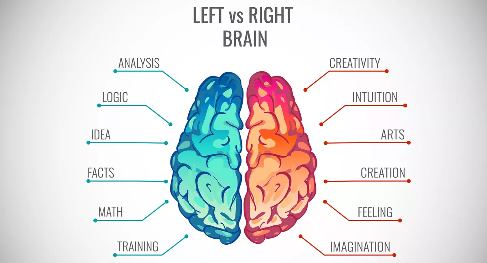

I'm sure you have heard of the "left brain - right brain" idea.  If you haven't, let me explain.  There is a popular theory that people who are left brain dominant are logical people, excelling at subjects like math, while right brain dominant people are more creative, excelling at the arts.  Whether or not this is science or pseudoscience, it's an easy way to describe oneself.

Me personally, I'm definitely a left brain person.  And after spending a week or two learning about HTML, CSS, and Bootstrap 5 and trying to replicate websites, I gained an appreciation for those who's brains are more balanced than mine.  I now understand why there are university level classes, and even majors, dedicated to UI and webpage design.

## A good UI is more than just "looking pretty"

## In the context of engineering

Ever hear people ragging on engineering companies for delivering late and way over budget? Well, some engineering jobs are really difficult, especially if the requirements and funding are undulating underneath you. Because of the nature of the problem, sometimes engineering firms require large amounts of engineers and workers, inviting further problems and delays.

The Honolulu Rail project at home has become this sort of poster child of failure, budget overrun and overall incompetence in Hawaii. Well, working though regulatory boards and fiscal procedures in Hawaii seems like it's a mind bogglingly difficult job to do. Granted, there might be some fishy stuff going on, but I refuse to believe that everyone is involved for nefarious reasons.

The problem of creating an unprecedented public transportation backbone on an island is difficult! I'm not sure we would have done it right, even if the best people were involved.

## In the context of relationships

So in the end, we realize that all engineering and programming is there for a reason - to serve human needs. Maybe that's why those things are difficult, because they both involve humans and are for humans.

Relationships, regardless if they're romantic or not take work. Humans are fickle creatures and relationships can come and go with the wind. To properly maintain something over time requires work. Family takes work. Marriage takes work. We live to figure out what works and what doesn't and hope that as we move forward we're improving.

Relationships have always been difficult, and by nature will continue to be so.

## Okay!

So back to the original premise; why is being one of the club officers so difficult?

And the final answer - it's supposed to be difficult, and it's supposed to challenge you, just like everything else that humans do that is difficult: programming, engineering, engaging in relationships, pondering the universe, etc.

Ultimately the question you should really ask yourself if something if particularly difficult is then "is it worth it"? That is something that is context specific and only you can answer yourself.
