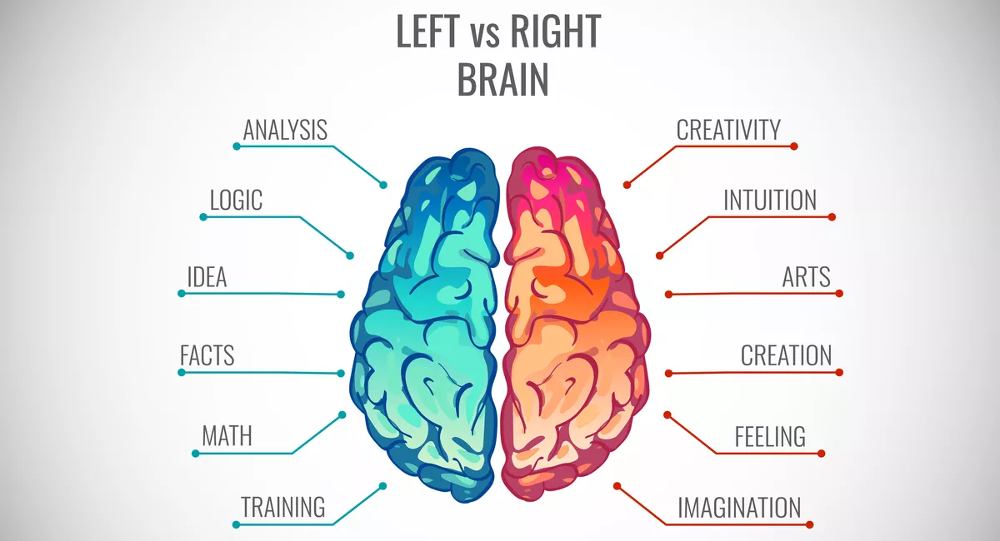
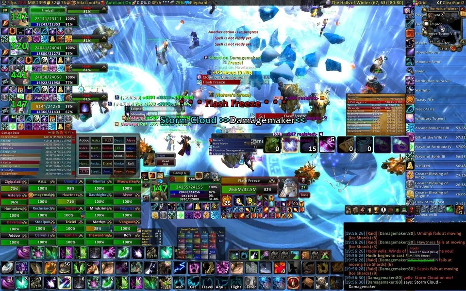

## Left vs Right Brain

    

I'm sure you have heard of the "left brain - right brain" idea.  If you haven't, let me explain.  There is a popular theory that people who are left brain dominant are logical people, excelling at subjects like math, while right brain dominant people are more creative, excelling at the arts.  Whether or not this is science or pseudoscience, it's an easy way to describe oneself.

Me personally, I'm definitely a left brain person.  And after spending a week or two learning about HTML, CSS, and Bootstrap 5 and trying to replicate websites, I gained an appreciation for those who's brains are more balanced than mine.  I now understand why there are university level classes, and even majors, dedicated to UI and webpage design.

## Looking Good is Critical to UI Functionality
The game "World of Warcraft" is highly configurable with mods and add-ons, allowing the player to change their UI to something that suits them best.  Many players, including those at the upper echelons of skill, choose to limit the amount of displayed UI so only the most vital of information shows.  I've seen good players with UIs with as little as 10 icons.

And then you have people who enjoy playing like this:

    

Similar to WoW, A good webpage is visually attractive with a good color scheme, some relevant pictures, and only the most necessary information present, with the rest accessible via links.  For example, on a restaurant's site, most people are only interested in the hours, location, phone number, pictures of the food, and a link to the menu.  How hard can that be with so little requirements?  I used to look at a website and think that the hardest part was not coding it, but arranging the pictures and text so it looks good.  The coding, I thought, was the simpler part of the process.

I learned very quickly reality is much different.  UI Frameworks share very little similarity to "standard" coding languages like Java or Python.  We aren't dealing with arrays, sorting algorithms, or manipulating user input.  We are making rows and columns and aligning lists to appear in the lower left of a backgrounded image and a few links to subpages on the bottom of the site.  The syntax of the language is entirely different from what I am used to, and the whole thought process and application is different too.  It felt like I was trying to use code to get a computer to draw a picture.  This is why we have front end and back end developers, because the skill-set is very different.

## Did I enjoy learning how to make webpages?
I had no experience with UI framework languages, and I found learning it to be very challenging, if not downright frustrating, trying to get a functioning page.  Something as simple as text or image alignment would drive me up the wall.  One of our assignments was to recreate a webpage, which took me several hours to get just a small part of the site replicated poorly.

The original:

    

My poor attempt:

    

And this was using Bootstrap, which is supposed to make web page development easier!  I couldn't even begin to imagine what I would need to do to make a page with just HTML and CSS.  At the end of the day, this was an interesting learning experience, and I have a newfound appreciation for front end developers.  But I also realize that the ocean that is programming is both wide and deep, and how developers from all aspects, from front end to back end to data science, should all be respected because their jobs are NOT easy.