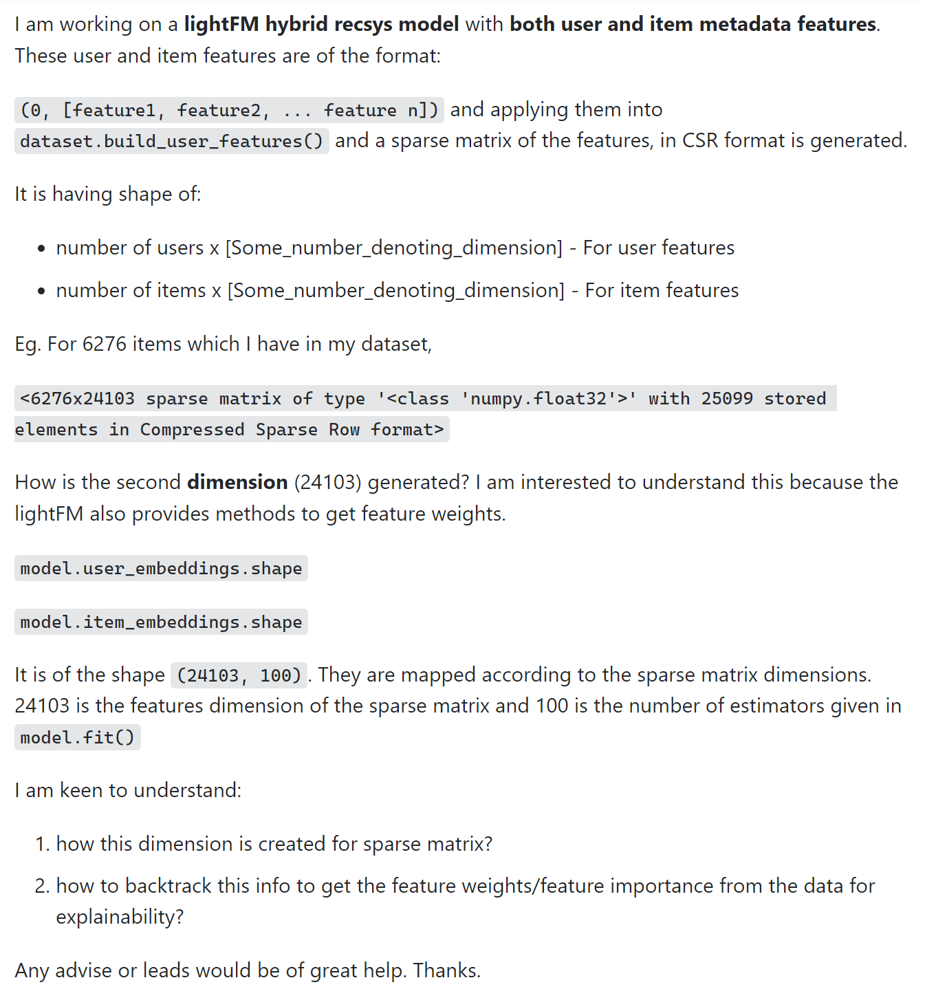

 I'm sure that you've experienced running into a problem that you can't seem to wrap your head around no matter how much effort you put into trying to understand it.  You might spend a day reading a textbook, another 10 hours trying to conjure help up on Google, rounded out by a few hours of trying to brute force progress doing the same things you've been doing for the past day.  The simple solution is often to ask for help.  After all, why spend all those hours bashing your head against the wall when you can reach out to someone with the knowledge and experience to help you in a fraction of the time?

While the concept is simple, the actual act of asking for help is much more difficult.  Ignoring any social anxiety you might have, a big issue in asking (and receiving) help is the work you've put into understanding your question and how you ask it.  If you run into a problem and only spend 5 minutes trying to understand and solve it before going for help, you might not any responses other than a suggestion to do your homework.  If your question is just "HELP!!! I tried a thing and it didn't work!"...well thats cool and all, but where's the rest of your question?  There is a technique to asking what are called "smart questions."

## What is a "Smart Question"?
A "smart question" is one that respectfully proves effort on your part to understand and provides enough information for someone to help you.  You can think of a smart question as one that follows these rules:

1. You understand the content your problem is addressing.  It is not appropriate to ask a multiplication problem if you don't understand addition.  
2. Using this knowledge, provide the work where you attempted to solve the problem and are be to explain these attempts.  If you are looking for help on some code you wrote, provide the code in raw text, not an image.  This allows someone to copy paste your code to try and help you instead of having to hand jam it from an image.  
3. It might also be a good idea include where you think something is going wrong, why it's wrong, and any bad results.  
4. Keep the background info clear and succinct.  No one wants to read 5 pages of fluff for 2 paragraphs of pertinent information.  
5. Your question must be clear, to the point, and descriptive of what kind of help you are looking for.  
6. And most importantly, *be respectful*.  You are asking for help.  No one is obligated to respond, or even be nice to you.  
  
These points are pretty self explanatory.  Let's see some examples of good and bad smart questions.

## A "Smart" Question

[How to understand the dimensions of Sparse matrix (Compressed Sparse Row format) generated in lightFM to map it to #features?
](https://stackoverflow.com/questions/73657067/how-to-understand-the-dimensions-of-sparse-matrix-compressed-sparse-row-format)
  
  
  
While I have no idea what this is asking, you can easily tell the poster is well informed about the subject they are stuck on.  The title is detailed and clear, and provides enough relevant information that people knoweldgeable in the subject will know what they are asking and can enter thread knowing what to expect.

Looking at the contents of the post, it is written very well.  The text is formatted to highlight important parts.  They provide proof of their knowledge, provide examples and explain what is happening in them, and asks short, detailed questions that clearly ask what they want to know more about.  The poster then ends with a  thank you and a request for leads or advice instead of outright asking for an answer, showing that they are willing to do more self learning before coming back with further questions.  

## A Question...That Could be Better

[How to prevent data from disappearing on webpage](https://stackoverflow.com/questions/73656946/how-to-prevent-data-from-disappearing-on-webpage)

The title of the post provides very little information.  Reading this brings more questions than it answers.  Is this a programmer asking the question?  A user?  What language is the code in?  What browser?  What event is leading to his loss of data?  The content of the post is not much better.

  
  
Now we know a little more, but there's still nothing to work off of.  What has this person tried to do?  Where is the code?  What kind of site is this?  Have you done any research on this?  What do you already know?  A question like this seems like the poster is asking for someone to do all the work for them.  To answer a question like this, one would have to explain everything, from how JavaScript stores data to several possible reasons why this data loss might be occuring.  Who knows if the user will even understand what you replied with?  No one has time for this sort of question.  This question was found in "Newest", and it will probably be left with very little views and no responses because of the lack of effort on the part of the poster.
