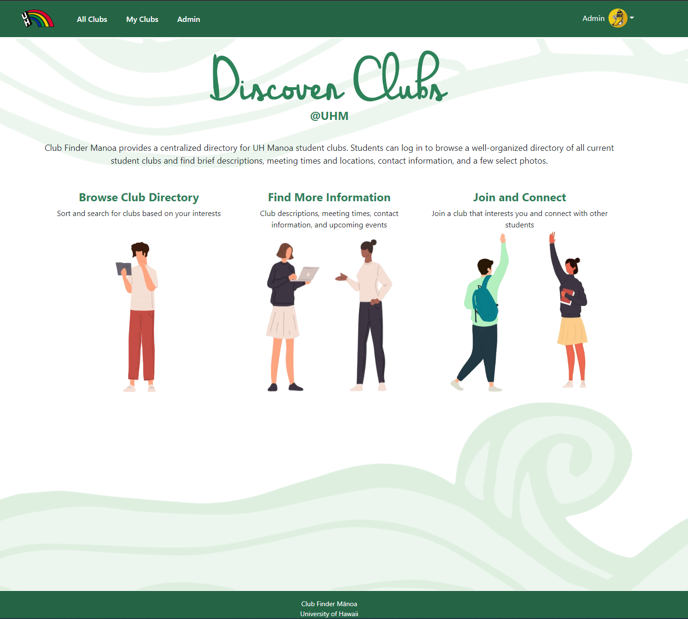

# Club Finder Manoa

    

For the final, culminating project of ICS 314 (Software Engineering I) at the University of Hawaii at Manoa, Destynee Jean A. Fagaragan, Gwyneth U. Raquepo , Robert D. Godfrey , Jayson K. Iwanaka, and I, Galen C. Chang, were tasked with solving the problem of creating an application that would provide a centralized repository for the University of Hawaii at Manoa's 200+ RIOs (Registered Independent Organizations).  Our answer is the Club Finder Manoa app.

Club Finder Manoa is a web application solution to the aforementioned problem that utilizes Meteor, MongoDB, and React-Bootstrap.  Using the application, users can look up information about each club, such as a description, meeting times and locations, contact info, and more.  Users can also filter clubs based on interests or club type, and then save the clubs they are interested in.  If the user is a member of Club leadership, they can also modify the club profile.

Using Github repositories to store our code and issues to track requirements and work done to fulfill them, we developed the application over the course of six weeks.  I was responsible for several tasks, including schema modification, stylistic edits to the pages, and the creation of several pages that interacted with the backend MongoDB databases.  Of all these, the two most complex pages I made were the Edit User Profile and Edit Club pages.  For both of these pages, I had to learn how to pull specific bits of information from the MongoDB databases and how to use React-Bootstrap forms and code to present to the user the most intuitive way to change their information.  This includes showing the current data, accepting the current data if the user does not want to change it (I ran into several issues where if the user did not change a field, the current data would be wiped like the user intentionally left the field blank), and options or text fields for the user to change the data.  This turned into learning how to implement and modify the backend schemas, as several of the methods we thought were good ended up being less than ideal.

Aside from code specific lessons learned, it was a very eye opening experience to work with others in a development environment.  I have previous experience working in groups, but everyone could largely do their own thing and then the day before presentation day, we would get together and quickly merge everything together.  Here, a change to one file could dramatically affect how the application as a whole worked.  Constant communication was essential.  We all had to be available to answer questions regarding the files we were working on.  For instance, I had made changes to the schema so some of my pages would work.  I chose to commit an incomplete (but fully functional) branch to main because I made changes that were core changes to the program, and the work the others were doing were reliant on my changes.

[If you would like to learn more about Club Finder Manoa, you can read about it on our project homepage.](https://club-finder-manoa.github.io/)

[And the source code can be found here.](https://github.com/club-finder-manoa/club-finder-manoa).

