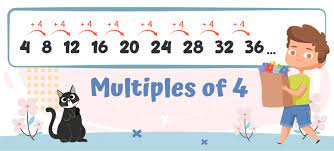
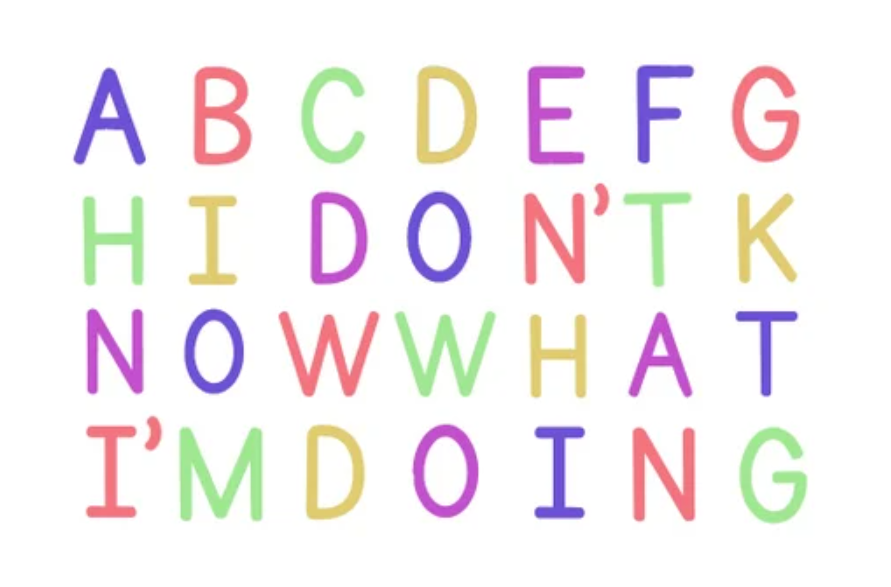

  

What was supposed to be a simple homework C program that prompts a user for an integer and outputs a table from 0 to that integer and if those numbers are divisible by 4 turned into a multi day headache due to misinterpreting the instructions.  The intention of the assignment was to get us to use scanf to get the user input, which makes input such as "123abc" perfectly fine, as scanf will only accept the "123" part if %d or %i is passed as the first parameter.

  

Due to my apparent inability to read, I thought "123abc" was NOT to be considered proper input under any circumstances.  This lead me down a rabbit hole, researching fgets to try and search the user input for any invalid characters or negative input.  After many hours, I managed to craft the correct if statements to parse for invalid characters or negative numbers...but then I went down another rabbit hole.  Because I had no way of dynamically sizing the char array fgets puts the user's input into, I ran into the issue where I had a static 100 char array and any unused indices would return an invalid character.  After another several hours, I managed to make a for loop, counting the number of characters until a newline was encountered. 

Working with others was strictly prohibited.  We could have very high level, abstract discussions about the concepts we needed to understand to do the homework, but could not directly discuss the homework itself or any methods to complete it.  I was effectively flying solo.  After spending days trying to understand fgets, scanf, the differences between the two and how they read and store user input, and crafting the right if statements, I came out a very tired, but much more knowledgeable C coder.  I also learned to read the instructions multiple times and read them carefully.

This project was a homework assignment from ICS 212 (Program Structure) at the University of Hawaii at Manoa.  [You can read the full details of the assignment here](https://www2.hawaii.edu/~berneyk/ics212/hw/hw2/hw2.html).

The code can be found at [this github repository](https://github.com/GalenChang/MultipleOfFour).
