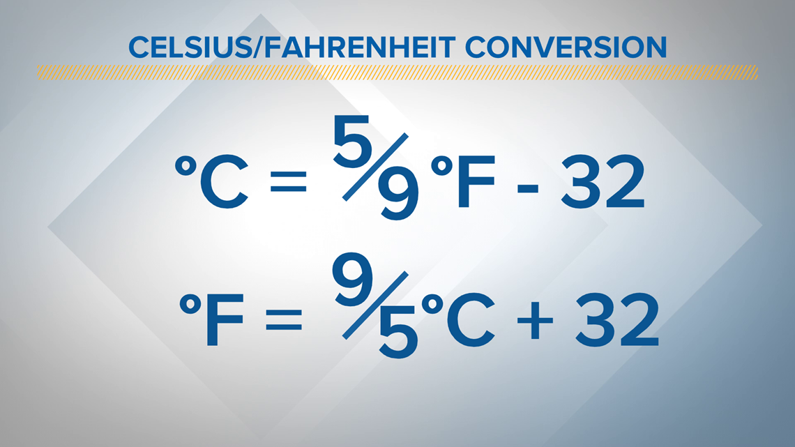

<div class="text-center p-4">
  
</div>

A very simple program that was done to practice Javascript fundamentals, which is a language we had only a week or two's worth of experience.  The program takes a user defined temperature and temperature scale to convert to the other temperature scale.  For example, if the user wants to covert 100 F, the program will output ~37.8 C.

Unfortunately, the user must change the code to get their desired conversions.  On the bottom of the code, there is a section that looks like this:

```cpp
console.log(temperatureConverter(212, "F"));
console.log(temperatureConverter(0, "C"));
```

The user can change the number and scale to whatever they want to convert.  The program also does error checking by verifying the user has entered a valid scale.  If the scale is not either F or C, then an error message is output to the user.

Working in groups of two, my partner and I managed to finish coding this up in just under 6 minutes.  Despite being a very basic task, it was slightly challenging due to us being unfamiliar with Javascript.  Fortunately, we have experience coding in Java, so there were not many huge differences between the two languages that we had to overcome.

This project was done as a "Workout of the Day" in ICS 314 (Software Engineering 1) at the University of Hawaii at Manoa.  [You can read the full details of the assignment here](https://courses.ics.hawaii.edu/ics314f22/morea/javascript-1/inclass-temperature-converter.html).

A link to the [JSFiddle can be found here](https://jsfiddle.net/galenc12/4zk7cLpb/10/).
Alternatively, the code can be found at [this github repository](https://github.com/GalenChang/TemperatureConverter).
